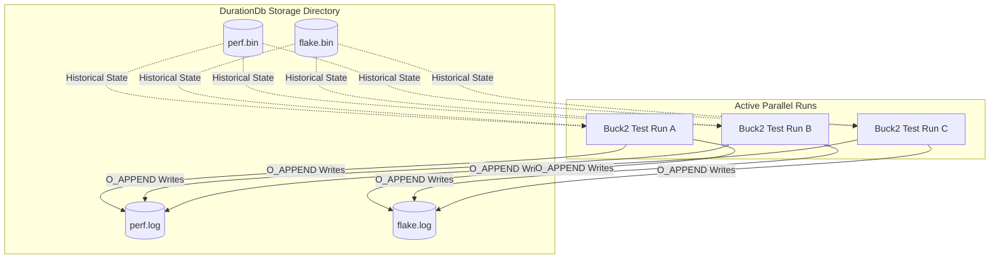
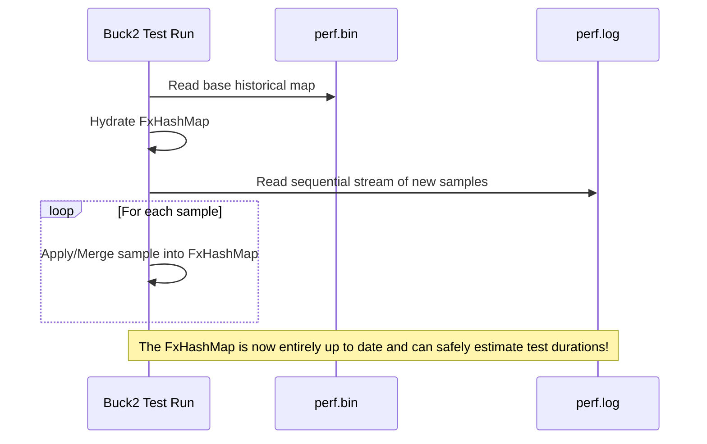

# DurationDb Architecture

The newly redesigned `DurationDb` tracks two primary datastores: the **Perf DB** (test run durations) and the **Flake DB** (test failure history). 

In order to meet the dual requirements of using **minimal space** and supporting **safe, efficient merging across parallel runs**, the architecture relies on an **Append-Only Log + Compaction** model, avoiding the need for heavy cross-process file locks on every flush.

## 1. Storage Architecture

Rather than reading and rewriting a single monolithic file on every run (which inherently overwrites data from concurrent runs unless strictly locked), the database is split into two components for both `perf` and `flake`:

1. **Base Files (`.bin`)**: Highly compact, deduplicated binary files containing the historical state up to a certain point in time. 
2. **Append-Only Logs (`.log`)**: Unstructured streams of lightweight execution records dumped by active parallel processes.



When a process calls `flush()` at the end of a test run, it takes the newly recorded test durations and flake outcomes and **appends** them natively to the `.log` files. Because POSIX `O_APPEND` operations stream bytes to the end of a file sequentially, 100 parallel processes can dump their telemetry data simultaneously without accidentally deleting each other's data or waiting to acquire an exclusive lock.

## 2. In-Memory Loading

When a new run boots up and needs to query the DB (e.g. `DurationDb::load()`), it combines the base historical file and the uncompacted log entries to achieve an up-to-date representation of the global state:



**Memory & Query Efficiency**
Instead of costly `String` keys, the targets and names derived from the `TestIdentity` are converted into 64-bit deterministic hashes (`u64`). This ensures that the in-memory `FxHashMap` lookups operate in strict $O(1)$ time with very minimal heap allocation overhead.

## 3. Automatic Compaction

If we only ever appended, the `.log` files would grow indefinitely. To solve this, `DurationDb::flush()` checks the size of the `.log` files before it finishes. If the log exceeds **512KB** (which translates to roughly ~20,000 distinct log entries), the process that crossed the threshold assumes responsibility for compacting the database.

```mermaid
stateDiagram-v2
    [*] --> CheckSize
    CheckSize --> Done: perf.log < 512KB
    CheckSize --> AcquireLock: perf.log > 512KB

    state AcquireLock {
        [*] --> Lock
        Lock --> LoadFullState: Lock Acquired
        LoadFullState --> WriteTmpBin
        WriteTmpBin --> AtomicRenameBin: rename(.tmp, .bin)
        AtomicRenameBin --> TruncateLog: std::fs::File::create()
        TruncateLog --> Unlock
        Unlock --> [*]
    }
    
    AcquireLock --> Done
```

During compaction:
1. An exclusive cross-process lock (`db.lock`) is acquired to halt other writers temporarily.
2. The system loads the fully merged state of both the `.bin` and `.log` files.
3. The unified state is streamed efficiently using `BufWriter` into a `.tmp` file using the dense structural binary format.
4. The `.tmp` file is atomically renamed to replace `.bin`.
5. The `.log` files are truncated back to 0 bytes.
6. The lock is released.

This guarantees minimal on-disk footprint without sacrificing concurrent data safety.
